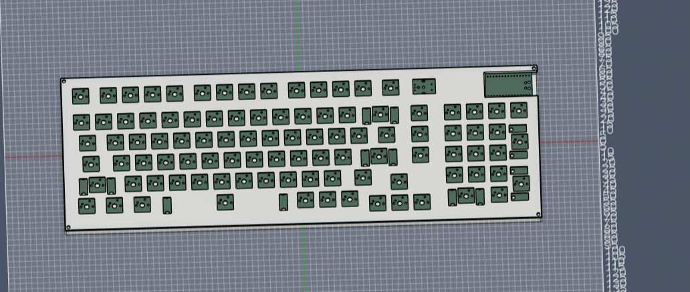
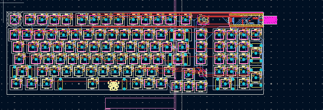
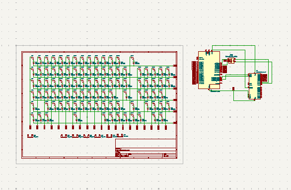

## Keeby

A custom 98-key mechanical keyboard: KiCad PCB design + QMK/VIA firmware,
built around a Raspberry Pi Pico and an MCP23017 I2C GPIO expander for
extra column pins.

## Project layout

- **PCB (KiCad)** — `Keeby.kicad_sch` / `Keeby.kicad_pcb` (not included in
  this firmware package). Built with the `marbastlib` library and the
  `kbplacer` plugin for switch/stabilizer placement. Routed mostly with
  Freerouting (via DSN export/import) with some manual cleanup for the
  remaining traces.
- **Firmware (QMK)** — the `keeby/` folder in this package. Generated
  directly from `Keeby.net` (the KiCad netlist), not guessed — every
  key's row/col and every MCU/expander pin was traced net-by-net.

## Hardware summary

- **MCU**: Raspberry Pi Pico (RP2040)
- **I/O expander**: MCP23017 over I2C1 (SDA=GP26, SCL=GP27), address
  `0x20` (A0/A1/A2 all grounded) — used to get 5 extra column pins
  beyond what the Pico's GPIO could cover directly
- **Matrix**: 6 rows × 20 columns, COL2ROW diodes
  - Rows 0–5: direct Pico GPIO (GP0–GP5)
  - Columns 0–9, 15–19: direct Pico GPIO (GP6–GP15, GP18–GP22)
  - Columns 10–14: MCP23017 GPA4, GPA3, GPA2, GPA0, GPA1
- **Rotary encoder** (SW99): A/B on GP16/GP17 (native QMK encoder
  driver); push button wired through the MCP23017 (GPA5 held
  permanently low, GPA6 read as input) — handled as a virtual matrix
  key in firmware so it remaps like a normal key

  
  
  